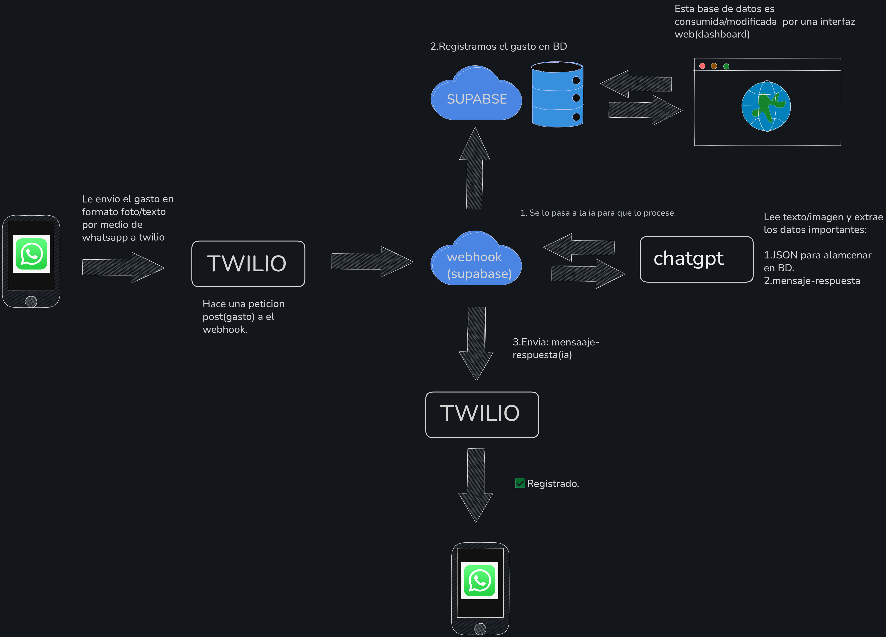

# 📦 MVP - Sistema de Registro de Gastos vía WhatsApp

---

## 🎯 Objetivo del MVP

Construir un sistema funcional que permita:

* Enviar mensajes (texto/imágenes) vía WhatsApp
* Recibirlos en el sistema
* Almacenarlos en una base de datos
* Visualizarlos en un dashboard web
* Responder automáticamente con un mensaje simple

---

## 📌 Alcance del MVP

### ✅ Incluye

* Envío de mensajes por WhatsApp
* Recepción de mensajes mediante webhook
* Almacenamiento de datos en base de datos
* Visualización de datos en dashboard (React)
* Respuesta automática básica ("Recibido")

---

### ❌ No incluye (por ahora)

* Integración con IA (procesamiento inteligente)
* Parsing avanzado de datos
* Validaciones complejas
* Manejo de estado conversacional
* Sistema multiusuario
* Autenticación

---

## 🧱 Fases de Desarrollo

---

### 🥇 Fase 1 — Flujo End-to-End (sin IA)

**Objetivo:** Validar que los mensajes llegan correctamente al sistema.

1. Crear cuentas en Twilio y Supabase
2. Configurar WhatsApp Sandbox en Twilio
3. Crear webhook (Supabase Edge Function)
4. Recibir mensajes en el webhook
5. Loggear los mensajes recibidos

---

### 🥈 Fase 2 — Persistencia mínima

**Objetivo:** Guardar los mensajes recibidos en la base de datos.

6. Crear tabla simple en Supabase
7. Almacenar mensaje recibido (raw)

---

### 🥉 Fase 3 — Respuesta básica

**Objetivo:** Validar comunicación bidireccional.

8. Enviar respuesta automática desde el webhook

   * Ejemplo: `"Recibido"`

---

### 🏅 Fase 4 — UI básica

**Objetivo:** Visualizar los datos almacenados.

9. Crear aplicación en React (Vite)
10. Conectar con Supabase
11. Mostrar lista de mensajes/gastos

---

### 🧠 Fase 5 — Integración con IA(Lectura de imagenes)

**Objetivo:** Procesar y estructurar los datos automáticamente.

12. Integrar IA para interpretar mensajes/imagenes.
13. Extraer datos relevantes
14. Validar información
15. Implementar flujo conversacional básico

---

## 🛠️ Plan de Implementación (Resumen)

1. Cuentas (Twilio + Supabase)
2. Configurar WhatsApp Sandbox
3. Crear webhook
4. Implementar logs
5. Crear base de datos simple
6. Guardar datos
7. Implementar respuesta automática
8. Crear UI básica
9. Integrar IA

---

## 🧠 Arquitectura General

---

## 📎 Notas

* Priorizar simplicidad sobre complejidad
* Validar cada fase antes de avanzar
* Evitar sobreingeniería en etapas iniciales
* Enfocarse en flujo funcional antes que en optimización

---
